### RES-102: Crash after leaving My orders

**Repro:** Open My orders with an active order, go back within 2 seconds.
Debug console shows ***setState() called after dispose()***.

**Root cause:** `_PickupCountdownState.initState` starts a `Timer.periodic`
but never keeps a reference to it. Therefore, when the page closes, the State is
disposed, but the timer keeps running and calls `setState` on the dead State.
The crash is the visible symptom; the real bug is the leaked timer.

**Fix:** Store the timer in a field and cancel it in `dispose()`.

**Rejected alternative:** `if (mounted) setState(() {})`. It hides the error by prevent rebuilding after the State is disposed,
but the timer would still run forever for every tile ever opened.

**Edge cases:** Handled: multiple tiles, each cancels its own timer.
Not handled: the timer still ticks after the pickup window opens. The feature ticket, `F-1` will replace this with a shared ticker.

---
 
### RES-103: Requests pile up the longer you browse
 
**Repro:** Open a deal, popping back. Then open a another and
tap "Add to bag". The console shows one `GET /deals/:id` for every deal
opened earlier, not only the current one.
 
**Root cause:** `DealDetailsController.onInit` subscribes to
`cartService.itemCount` with `ever(...)`. `CartService` is permanent, so it
holds that callback for the whole session. The route binding deletes the
controller when the page closes, but the worker is not cancelled with it.
Every deal ever opened stays subscribed, and each cart change runs one
callback (and one fetch) per old deal.
 
**What I had to learn:** I was not familiar with GetX workers. `ever` returns
a `Worker` object. The subscription lives on the observable it listens to
(here, the permanent `CartService`), not on the controller, so deleting the
controller does not stop it. The `Worker` has to be kept and disposed by hand
in `onClose()`, the same way a `Timer` is cancelled in `dispose()`.
I read the GetX docs on workers and checked the behavior in the console.
 
**Fix:** Keep the `Worker` in a field and call `dispose()` on it in
`onClose()`. Also check `isClosed` after the `await`, so a request that was
already in flight does not update a closed controller.
 
**Rejected alternative:** Return early with `if (isClosed) return;` at the
top of the callback. The requests stop, so the symptom in the ticket goes
away, but the callbacks and the closed controllers stay in memory for the
whole session and still run on every cart change. The leak remains.
 
**Edge cases:**
- Handled: a request still in flight when the user leaves the page.
- Not handled: the open page still re-checks stock when the cart changes for
  a different deal. 
------

### RES-101: Search shows results for the wrong query

**Before**
 
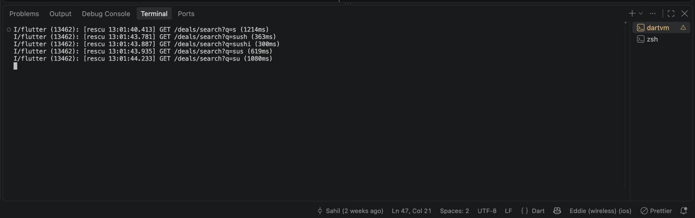
 
**After**
 
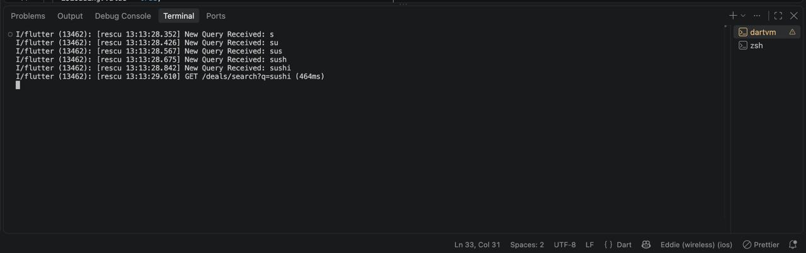

**Repro:** Open Search and type "sushi" quickly. The final list often does not
match the text box. 

**Root cause:** Each keystroke starts a new request and nothing checks that the
response is still the latest one. The fake API answers short queries more
slowly than long ones, so the reply for "s" can arrive after the reply for
"sushi" and overwrite it. `isLoading` had the same problem: the first request
to finish set it to false while newer requests were still running.

**Fix:** Give each input change an increasing request id. After the `await`,
ignore the result if the id is no longer the newest. Only the newest request
can change `results` or `isLoading`. I also added a 300 ms debounce to send
fewer requests, and cancel the debounce timer in `onClose`.

**Rejected alternative:** Debounce only. It is the classic debounce drawback. It reduces the problem but does not
remove it, because a slow request from earlier can still finish after a fast
one. The request id is what makes the result correct.

**Edge cases:**
- Handled: clearing the text while a request is in flight. The clear bumps
  the id, so a late result cannot fill the list again.
- Handled: an error from an old request is ignored.
- Not handled: cancelling the HTTP request itself. The fake API has no cancel,
  so I only ignore the old result.

------
### RES-104: Duplicate deals in the home feed

**Before**
 
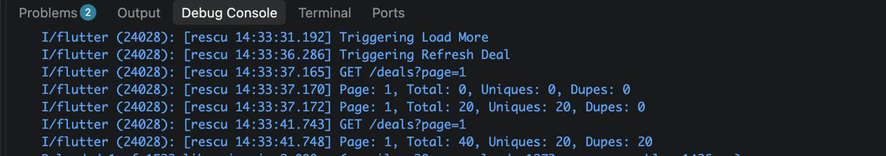
 
**After**
 
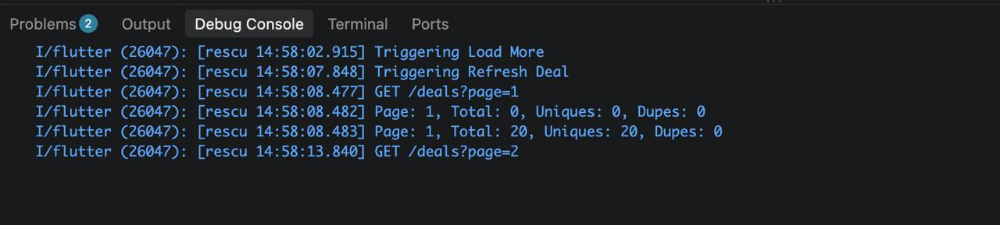

 
**Repro:** My low-end Android device was too slow to time the gesture (pull
to refresh while page 2 is loading), so I forced the timing from code. I added
a temporary 10 second delay at the start of `loadMore` and a listener on
`deals` that logs the total, unique and duplicate counts. The delay is
artificial, but real network latency creates the same race with a shorter
window. I started `loadMore`, then pulled to refresh during the delay.
 
Before the fix, the console showed:
- After the refresh: `Page: 1, Total: 20, Uniques: 20, Dupes: 0`
- When the delayed `loadMore` finished: `Page: 1, Total: 40, Uniques: 20,
  Dupes: 20`
The delayed `loadMore` also sent `GET /deals?page=1` instead of page 2,
because the refresh had reset `_page` while it was waiting.
 
After the fix: the
stale `loadMore` result is ignored (no new `Page:` line, Total stays 20,
Dupes 0).
 
**Root cause:** `refreshDeals` and `loadMore` share `_page`, `_totalPages`,
`deals` and `_isFetchingMore`, but they do not know about each other. Refresh
resets `_page = 1` and replaces the list. A `loadMore` that was already
running then finishes and appends its result with `addAll` onto the fresh
list. It can also read `_page` after the refresh reset it, which is why the
log shows page 1 being fetched and appended a second time. The catch block
has a similar problem: `_page--` after a refresh can push `_page` to 0.
Because the catalog has a fixed size, this is how the feed ends up with more
items than the catalog contains.
 
**Fix:** A counter, `_refreshId`, that increases on every refresh.
- `refreshDeals` increments it, and after the `await` it drops its result if
  a newer refresh has started.
- `loadMore` remembers the counter when it starts and drops its result if a
  refresh happened in the meantime.
- `_page` is only updated after a successful, current response. `loadMore`
  computes `nextPage` before the request instead of doing `_page++` and
  `_page--`.
- `loadMore` does not run while a refresh is in progress (`_isRefreshing`).
- A stale request cannot reset `_isFetchingMore` or `_isRefreshing` of a
  newer one, because those resets are also checked against the counter.
**Rejected alternative:** Remove duplicates by id when adding items. The list
would look right, but `_page` and `_totalPages` would still be wrong, so
paging would break later. It hides the symptom without fixing the shared
state.
 
Also rejected: ignoring pull to refresh while `loadMore` is running. The user
pulls and nothing happens, which is worse than fixing the race.
 
**Edge cases:**
- Handled: refresh during `loadMore`, `loadMore` during refresh, and a failed
  `loadMore` after a refresh.
- Handled: two refreshes at once. The newest one wins.
- Not handled: cancelling the HTTP request itself. The fake API has no
  cancel, so I only ignore the old result.
- Not handled: error handling for a failed refresh (the refresh indicator is
  not completed on error). That is a separate issue.
---
### RES-106: Wrong pickup times; "Pickup today" filter misses deals

**Before**
 
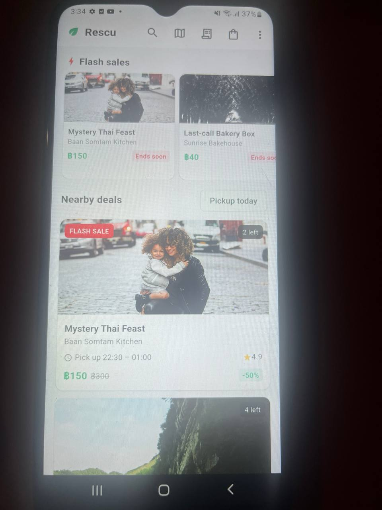
 
**After**
 
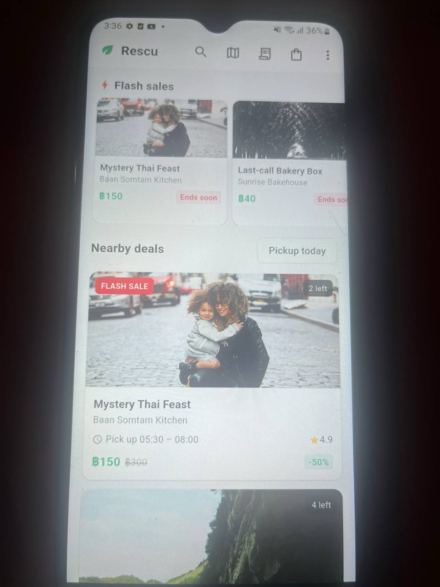

 
**Repro:** The bakery that opens 06:00 to 09:30 showed "Pick up 23:00 – 02:30".
With "Pickup today" on, some stores with a slot today were missing.

**Root cause:** The backend data is correct. The API sends ISO-8601 UTC
instants, and `DateTime.parse` on a string ending in `Z` returns a UTC
`DateTime`. `DateFormat('HH:mm')` prints those UTC fields, so the label shows
UTC hours. The store is in UTC+7, so 06:00 local is 23:00 UTC. Separately,
`isToday` compared `start.day` (a UTC day of the month) with
`DateTime.now().day` (a local day). A store that opens at 06:00 local starts
on the previous UTC day, so it was filtered out. The check also ignored month
and year.

**Fix:** Convert the parsed instants with `toLocal()` in
`PickupWindowModel.fromJson`, once, where the data enters the app. `isToday`
now compares year, month and day of the local start with the local `now`.
`isOpenNow` and `untilStart` compare instants and did not need changes.

**Rejected alternative:** Hard-code UTC+7 in the app. It would always show the
same hours, but it copies a hidden backend value into the client and breaks
with a second market. Fixing only the label format in the presentation layer also should be rejected, because
`isToday` would still be wrong.

**Edge cases:**
- Handled: stores that open before 07:00 local now appear in "Pickup today".
- Handled: month and year boundaries in `isToday`.
- Handled: overnight windows count as "today" by their start date.
- Not handled: (Currently hardcode time offset) a device in a different time zone from the store (see the
  decision above).
- Not handled: (Rare Case) a time zone change while the app is running. Times parsed
  earlier keep the old zone until the data is reloaded.

---
### RES-105: Home feed is janky and memory keeps climbing

**Before**
 
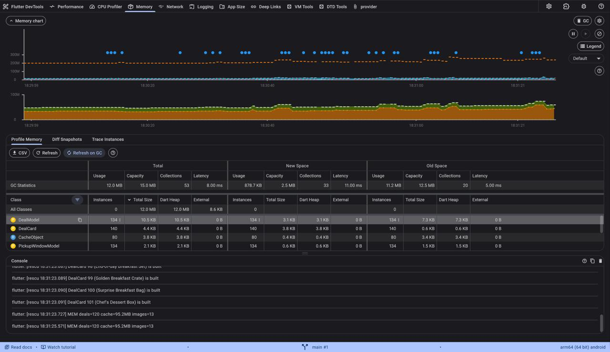

 
**After**
 
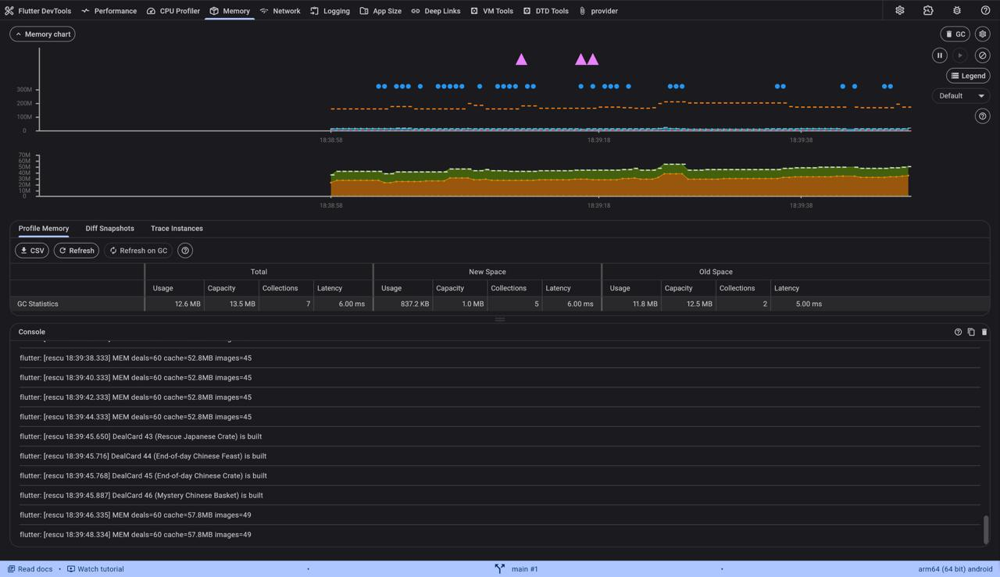

 
 
**Repro:** Scroll the home feed on a slow physical Android device in profile
mode (`flutter run --profile`,). I added
temporary logs (a `debugPrint` in `HomeScreen.build` and `DealCard.build`, and
a timer that prints the deal count and the image cache size and image count).
I measured with the DevTools Memory tab and the console.
 
**Root causes (three):**
1. **One `Obx` around the whole `Scaffold`.** It read `scrollOffset`, which
   changes on every scroll tick. So the app bar, the flash rail and every
   visible card rebuilt on every tick, even though only two facts were needed:
   offset above 4 (app bar shadow) and above 800 (scroll-to-top button).
2. **The feed was a `ListView` with a `children` list.** Each rebuild (one
   per scroll tick because of cause 1) created a `DealCard` widget for every
   loaded deal and copied the list in `visibleDeals`, so the cost per frame
   grew with each page loaded. (I first thought this built every card at once.
   That was wrong: Flutter only builds the cards near the viewport. The
   cost is the per-rebuild allocation, which the measurements support.)
3. **Full-size image decoding.** The API sends 1600x1200 images shown at about
   160 px high, and `CachedNetworkImage` had no `memCacheWidth`. Each image was
   decoded at full size, so the image cache filled almost at once.
**Before (measured):**
- Console: the same visible `DealCard`s were rebuilt again and again while
  scrolling. `Home Screen has been built` appeared every 34 to 130 ms, each
  pass rebuilding all visible cards and taking about 15 ms, which is most of a
  16 ms frame.
- Image cache: 95.2 MB with 13 images at 20 deals, and exactly the same at 80
  and 120 deals. That is about 7.3 MB per image, a full 1600x1200 decode. The
  cache was full at 13 images, so scrolling likely evicts and re-decodes
  images (not measured directly).
- RAM: RSS about 190 to 260 MB during scrolling, and 365 MB in one earlier
  run. This device varies a lot between runs.

**Fix (three separate commits, measured after each):**
1. `isScrolled` and `showScrollToTop` bools that change only when a threshold is
   crossed. `Obx` now wraps only the app bar, the body data and the
   scroll-to-top button, not the whole screen.
2. `memCacheWidth` in `TheNetworkImage`, from the real layout width
   (read with `LayoutBuilder`) times the device pixel ratio. I set only the
   width so the aspect ratio is kept.

**After (measured):**
- Console: each `DealCard` is built once when it scrolls into view, seconds
  apart, and no repeated `Home Screen has been built` lines appear.
- Image cache: 46.6 MB with 40 images at 40 deals; 52.8 to 57.8 MB with 45 to
  49 images at 60 deals. That is about 1.2 MB per image, about 6 times smaller.
  With the same 100 MB limit, about 6 times more images fit in the cache.

| | Before | After |
|---|---|---|
| Image cache at 40 to 60 deals | 95.2 MB, 13 images | 46.6 to 57.8 MB, 40 to 49 images |
| Size per decoded image | about 7.3 MB | about 1.2 MB |
| Home screen rebuilds while scrolling | every 34 to 130 ms | none seen |
  
**What did not change (honest note):** RSS and GC counts looked similar between
runs and are within this device's normal variation, so I do not claim an
improvement there. The image cache limit is the same 100 MB, so at very deep
scroll the total still approaches it. The gain is that images are much smaller,
so it takes far longer to reach the limit and images are less likely to be
evicted and decoded again.
 
**Rejected alternative:** Lowering `imageCache.maximumSizeBytes` on its own. It
caps memory, but each image would still be decoded at full size, so fewer
images would fit and they would be decoded again more often. It treats the
symptom. It could be added on top of right-sized images if a tighter memory
limit is needed.
 
**Edge cases:**
- Handled: the "Pickup today" filter, pull to refresh, load more, the app bar
  shadow and the scroll-to-top button still work.
- Not handled: precaching images ahead of the scroll, and the cost of the
  shimmer placeholder animation while many images load.
- Not handled: very high pixel ratio devices decode larger images. I did not
  cap the ratio.
---

### RES-107: Deep link opens to a crash

**Repro:** Home, overflow menu, "Simulate deep link…", open
`rescu://open/deal?id=42&source=push`. The app threw
`type 'Null' is not a subtype of type 'DealModel'`. 

**Root cause:** `DealDetailsController.onInit` did
`Get.arguments as DealModel`. The home feed passes the full model as an
argument, but a deep link only carries `id` and `source` in the URL, so
`Get.arguments` is null and the cast throws.

**Fix:** Added a `DealDetialsScreenState` (loading, success, failure).
`loadDeal()` resolves the deal either way: from `Get.arguments` if it is a
`DealModel`, otherwise by fetching `Get.parameters['id']` with
`dealRepo.fetchById`. The screen shows a spinner while loading and an error
state with "Try again" only on a real failure. The cart-change worker is
created inside `loadDeal()`, guarded with `??=` so it is set up exactly once,
whether the first load or a retry succeeds. This also fixes a second bug I
found while testing: an earlier version created the worker only after the
very first `loadDeal()` call, so a failed load followed by a successful retry
left the page never re-checking stock for the rest of its life.

**Decision:** The code always calls
`dealRepo.fetchById` even when the feed already passed the full model, to
avoid showing stale data. The trade-off is an extra request and some latency
on every open from the feed, where opening used to be instant.

**Rejected alternative:** Redirect to Home or show an error page when the
argument is missing. The ticket rules this out.

**Edge cases:**
- Handled: unknown id (404), a missing or non-numeric id, and a failed fetch
  all show the error state with a retry button instead of crashing.
- Handled: leaving the page while a request is in flight (`isClosed` checks).
- Handled: a cart-change worker is never created before `deal` is set, so it
  cannot crash on an unset value, and it is created exactly once even after a
  failed-then-retried load.

---
### F-1: Live flash-sale countdowns

**What I built:** replaced the static "Ends soon" badge with a real
countdown (`mm:ss` / `hh:mm:ss`) on flash deals — home feed, flash rail,
and details screen.

**How it works:** one shared `TickerService` (`Timer.periodic`, 1s) instead
of a timer per card. `FlashSaleService` tracks which deals have expired and
is the single place that removes an expired deal from the cart, so it only
happens once even if the deal is showing on more than one screen at a time.
The badge itself (`FlashSaleEndInWidget`) is one shared widget used in all
three places, so the countdown formatting only lives in one spot.

**Why one timer, not one per card:** same lesson as RES-102 — 100+ cards
with their own timers means 100+ rebuild triggers a second. One ticker
means each countdown only rebuilds its own small `Text`, not the card.

**Mistakes I caught along the way:**
- Had `Get.find` and `track(deal)` running inside the `Obx` builder, so
  it re-ran every tick for nothing. Moved it above the `Obx`.
- Wrote the `mm:ss` formatting twice (rail + card) before pulling it into
  one shared widget.

**Rejected alternative:** a timer per countdown widget. Simple, but it's
the RES-102 bug pattern at scale, and it would fail the "100+ countdowns
stay smooth" requirement.

**Edge cases:** handled — a deal already expired on first build; a deal
shown on two screens at once only gets removed from the cart once.

---
### F-2: Impression tracking

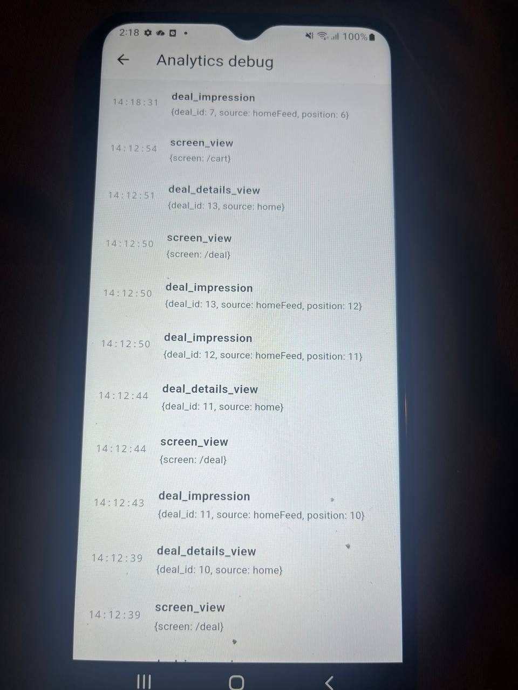

**What I built:** logs a `deal_impression` event when a deal card has been
≥50% visible for 1 continuous second, on the home feed, flash rail, and
search results. At most once per deal per session, across all screens.
Events are batched and sent through `FakeApiService.sendAnalyticsBatch`
every 10 events or 15 seconds after the first unsent one, whichever comes
first.

**How it works:** `DealImpressionWrapper` wraps each card with
`VisibilityDetector`. When a card crosses 50% visible it starts a 1s timer;
if it drops below 50% or the widget is disposed, the timer is cancelled.
Once the timer fires, it calls `DealImpressionService.trackImpression`,
which checks a `Set<int>` of deal ids already logged this session (so it
can never fire twice for the same deal), logs it locally via
`AnalyticsService` (so it shows up on the debug screen right away), and adds
it to a pending batch. The batch flushes on a 15s timer that only starts
from the first pending event, or immediately once it hits 10.

**A bug I did fix:** Using whole enum value instead of their string value
when assinging key in VisibilityDetector

**Edge cases:** handled — a card visible for under 1 second logs nothing;
the same deal shown in two lists at once (e.g. flash rail and home feed)
only logs once. 

---
### F-3: Stock reservations with optimistic UI

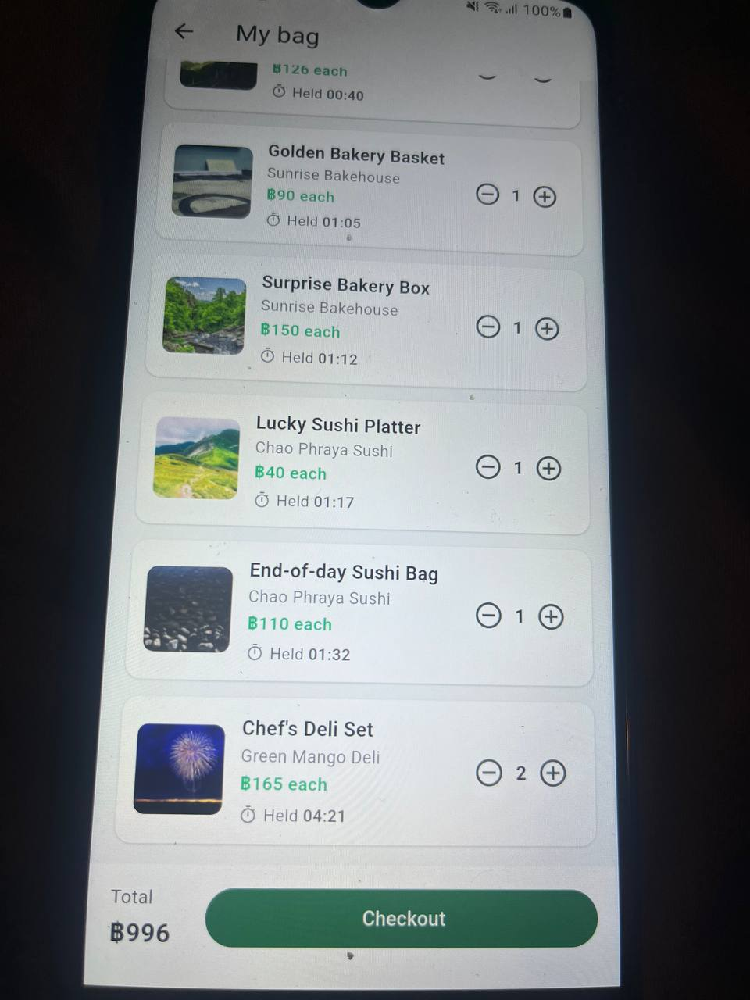
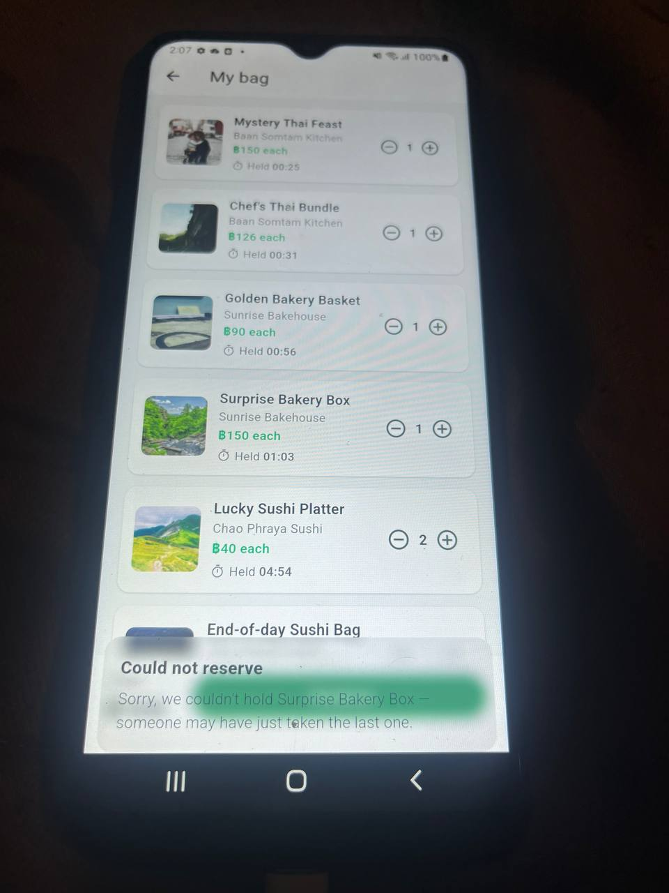
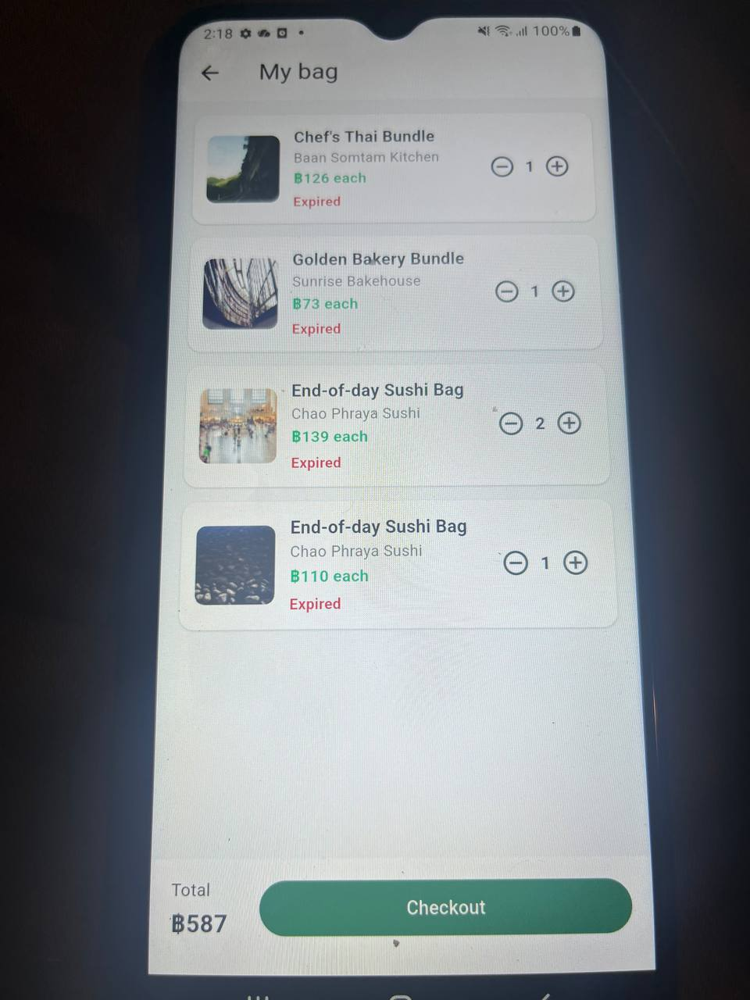

**What I built:** adding to the bag now makes a real reservation on the
backend instead of just being local. The item shows up in the bag right
away (optimistic), then the reservation call runs in the background. If it
fails, the item is rolled back — removed if it was a new line, or its
quantity reduced back down if it was an existing line — and the user gets a
plain message instead of a raw error. Each line shows a live countdown to
when its hold runs out. Removing a line (or reducing it to zero) releases
the hold. Checkout is blocked with a message if any line isn't fully
reserved, and a `410` from checkout (a hold expiring right at the wire)
re-checks the bag and tells the user to look at it again.

**A real bug I found while testing, not while coding:** the automatic
"check every second if any hold expired" logic (`checkForExpiredHolds`,
hooked to the same ticker from F-1) only actually ran when I manually
triggered it — a line would sit there showing an old countdown forever
unless I tapped checkout. Turned out the `onInit()` override that
subscribes to the ticker had gone missing from `CartService` somewhere
across a few rounds of edits — the method existed, but nothing was calling
it on its own. Found this by just sitting on the cart screen and watching
nothing happen, not by reading the code. Added `onInit()` back with
`ever(ticker.now, (_) => checkForExpiredHolds())`.

**Decision — what happens when a hold expires while still in the app:** I
went with: don't silently drop the item, don't silently renew it either
(that defeats the whole point of a 5 minute limit) — mark it clearly as
expired and block checkout until the user does something about it.

**Rejected alternative:** silently re-reserving expired items in the
background so the user never notices. Rejected because it lets someone
hold scarce stock indefinitely just by keeping the app open, which is the
exact problem the 5-minute limit exists to prevent.

**Edge cases:**
- Handled: a reservation failing on add/increment rolls back to the
  previous quantity (or removes the line entirely if it was new), not a
  full-bag reset.
- Handled: a line removed from the bag while its reservation call was still
  in flight — the reservation gets released instead of left dangling.
- Handled: checkout blocked up front if anything isn't fully reserved, plus
  a separate `410` handler for the rare case where a hold expires between
  that check and the server processing it.
- Not handled: reducing quantity always releases the old reservation and
  makes a brand new one for the smaller amount, instead of adjusting it in
  place — the API has no endpoint for that, so this is release-and-reserve
  in the same call.

---

## AI usage log

**Tools used:**
- Claude, for two things: (1) figuring out how to actually measure RAM usage
  for RES-105 when I couldn't get a straight answer from DevTools on my own,
  and (2) designing and implementing F-3 (reservations) from scratch — I
  walked through the architecture with it first, then had it generate the
  code, then tested and fixed bugs in it myself rather than trusting it
  blind.
- Also used it to turn my own rough, unorganized notes into this
  `solutions.md` file — I gave it the plain facts of what I did and it wrote
  them up properly.

**Two concrete examples where AI was wrong or misleading:**

1. **RES-105 root cause, partially wrong on the first pass.** When
   diagnosing why the home feed was janky, the AI's first explanation was
   that the `ListView` with a `.map()`-built `children` list was building
   *every* loaded deal card at once, no matter how far down the list it was.
   That's not actually how `ListView(children: [...])` works — Flutter only
   calls `build()` on cards near the viewport regardless of how the list was
   constructed. The AI caught and corrected this itself mid-explanation once
   I started actually measuring with `debugPrint`/`adb logcat` instead of
   just accepting the claim — the real cost was the *rebuild frequency*
   (from the one big `Obx`), not eager building. I kept the corrected
   version in the RES-105 write-up above and didn't act on the wrong one.

2. **In F-3, GetX `Obx` crash, wrong on two theories before the real cause.** While
   wiring the shared countdown widget (`CountdownLabelWidget`) that F-3's
   cart screen also reuses for each line's hold countdown, I hit a GetX
   runtime crash: "the improper use of a GetX has been detected... you
   probably did not insert any observable variables into GetX/Obx." I asked
   the AI what was wrong. First theory: that `RxSet.contains()` might not
   internally route through GetX's tracked getter, so reading
   `expiredDealIds.contains(dealId)` wasn't actually registering as an
   observed value. Second theory, after I said the first fix didn't work:
   missing `Key`s on the list items were causing Flutter to reuse an
   `Obx`'s element for a different deal between rebuilds. I tried the
   second one too — still crashed. The actual cause was much simpler than
   either: `deal.isFlashSale && flashSale.isExpired(deal.id)` short-circuits
   on `&&`, so for a deal with a null `flashSaleEndsAt`, the *only* reactive
   read in that `Obx`'s builder never ran at all — the widget just wasn't
   guarded against being built for a non-flash deal in the first place. I
   found this myself by adding a plain `if (deal.flashSaleEndsAt == null)
   return const SizedBox.shrink();` guard before the `Obx`, which fixed it
   immediately, and only afterward matched it back to what the error message
   had been saying from the start. Kept neither of the AI's first two fixes
   in the final code.

**How I verified AI output generally:** for RES-105 I didn't trust any
before/after claim without a number behind it — I measured with DevTools and
`adb shell dumpsys meminfo` myself rather than accepting a description of
what "should" happen. For F-3, I ran through every code path by hand
(successful reserve, 409 failure, removing a line, letting a hold expire)
rather than assuming the generated code worked because it compiled.

---

## Design questions

**Q1:** A `State`'s lifecycle is tied to the widget tree — Flutter creates
it with `initState()` when the widget is first built and calls `dispose()`
when that widget is permanently removed from the tree, and it's Flutter's
job to time this. A `GetxController`'s lifecycle is tied to GetX's own
dependency system — `onInit()` runs when GetX first constructs the
controller (via `Get.put`/`lazyPut`/binding) and `onClose()` runs when GetX
decides to delete it (route left and no longer referenced, or the app
closing for a `permanent` one). These aren't the same clock, and it's easy
to assume a `GetxController` cleans up automatically the way a well-behaved
`State` does. RES-103 exists because of exactly this: the controller
subscribed to `cartService.itemCount` with `ever(...)`, and that
subscription lived on `CartService` — a permanent, app-lifetime service —
not on the page controller. Leaving the page destroyed the controller, but
nothing told the subscription itself to stop, because nobody had written the
`onClose()` cleanup a `GetxController` needs just as explicitly as a
`State.dispose()` does.

**Q2:** Wrapping a large subtree in one `Obx` means *any* observable read
anywhere inside that subtree triggers a rebuild of the *entire* subtree, not
just the piece that actually changed. RES-105 was this exact mistake — the
whole `Scaffold` was inside an `Obx` reading `scrollOffset`, so every scroll
tick rebuilt the app bar, the flash rail, and every visible card, when only
a tiny "offset > threshold" boolean actually needed to change anything
visible. I decide how tightly to scope reactivity by asking, for each piece
of UI: if I comment out just this widget, does the reason for rebuilding
disappear? If yes, the `Obx` belongs around that widget alone, not its
parent. The countdown widgets from F-1/F-3 follow this: each line's `Obx`
wraps only its own `Text`, so a hundred countdowns ticking doesn't touch
anything above them.

**Q3:** A unit test on `PickupWindowModel` alone, independent of any widget:
feed it the bakery's real JSON (`start`/`end` as the UTC strings the API
actually sends), run it with a fixed, non-UTC time zone (e.g.
`TZ=America/New_York flutter test`, or however the test environment pins the
zone), and assert `label` reads `"06:00 - 09:30"` and `isToday` is correct
for a few `now` values straddling midnight. To make this possible, `isToday`
needs to stop reading `DateTime.now()` directly inside the model — it should
either take `now` as a parameter or go through an injectable clock, so the
test can control it instead of depending on whatever moment the test happens
to run.

---

## Time spent

| Desc | Time Spent |
|---|---|
| Setup (Flutter, Java, repo) | ~30 mins |
| RES-102 | ~10 mins |
| RES-103 | ~25 mins |
| RES-101 | ~35 mins |
| RES-104 | ~1hr 30 mins |
| RES-106 | ~20 mins |
| RES-105 | ~2 hr |
| RES-107 | ~15 mins |
| F-1 | ~35 mins |
| F-2 | ~1hr 30 mins |
| F-3 | ~2hr 10 mins |
| **Total** | **~600 mins** |

## With one more day
- **F-3:** add the missing "Reserve again" button on an expired line
  (right now expiring just blocks checkout with no way back except
  removing the item), and add the `isLoading` guard back to the cart
  screen's +/- buttons so a line's reservation call can't be double-fired.
- **RES-105:** finish the deeper-scroll evidence (80/100/120 deals, not
  just 40-60) to show the image cache still plateaus near the 100MB limit
  even with the fix, and confirm all the numbers were taken on Flutter
  3.27.0, not whatever version the DevTools URL showed earlier.
- **RES-107:** actually test the deep link cold-start case (`adb` with the
  app fully closed first) and note what Back does from a deep-linked page
  — both still marked TODO.
- **General cleanup:** a couple of leftover dead-code items I noticed
  along the way (an unused `initState` on `FlashDealsSection`, a couple of
  internal `get/src/...` imports instead of the public `package:get/get.dart`
  barrel) that don't affect behavior but I'd tidy up before shipping.
- **Platform adaptation:** everything so far was built and tested on
  Android only. I'd want a pass to check iOS-specific behavior — safe area
  insets around notches/home indicators, whether Material widgets
  (`Scaffold`, `SnackBar`, dialogs) feel out of place next to iOS system
  UI, back-gesture behavior versus the Android back button, and whether any
  spacing/sizing assumptions I made only hold on the Android devices I
  actually ran on.